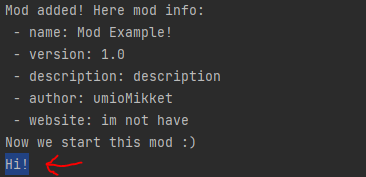

### 🏭 Basic mod loader for java!
This project provides the principles of a mod loader for reference.
Uses org.json dependency to read json files (here for mod.json).
You can use my code, or add it to your project.
Leaving credit to me is at your discretion.

Illustration of a basic mod loader:



[Link to mod code](src/main/java/com/umiomikket/modloader/ModExample.java)
[Link to mod info](src/main/resources/mod.json)

### 🏭 Creating a mod
Your project must have a dependency of this resource in any form (maven, copy of the project).
After this you have to create a class using ModClass class,
to determine the loader's main class for your mod.
Path to class: **com.umiomikket.modloader.ModClass**
This class has only one function: **void init()**.
This serves to start initializing your mod.

A small example:

```java
import com.umiomikket.modloader.ModClass;

class MyMod extends ModClass {
    public void init() {
        System.out.println("Mod initialized!");
        /* code... */
    }
}
```

After adding the class, you need to create a mod.json in your project resources, with the content:
```json
{
  "name": "Mod Example!",
  "version": 1.0,
  "description": "description",
  "author": "umioMikket",
  "website": "im not have",
  
  "main": "com.umiomikket.modloader.ModExample"
}
```
Fill it out as you wish, here is an example of accepted keys.
Important! The main value cannot be empty, unlike the others!
It points to the main class of the mod that we filled in earlier.
If other keys are empty, ModLoader will ignore them,
inserting null values into the ModInfo class.

This completes the creation of the mod!

### 📮 Using the ModLoader class
You can get the class using this path: **com.umiomikket.modloader.ModLoader**

#### Loading mods:
```java
/* You can do this through this function.
 * Requires mod path (String, Path) to load */
ModLoader.loadMod(String, Path path);

/* To load multiple mods,
 * You can use this feature.
 * Requires folder path (String, Path) containing mods */
ModLoader.loadMods(String, Path path);
```
Main! Mods can only be loaded as .jar files!

#### 📨 Getting mods:
In order to get all existing mods (their basic list), you can use the following methods:
```java
/* To get a hash map: HashMap<ModInfo: ModClass> */
ModLoader.getMods();
```
